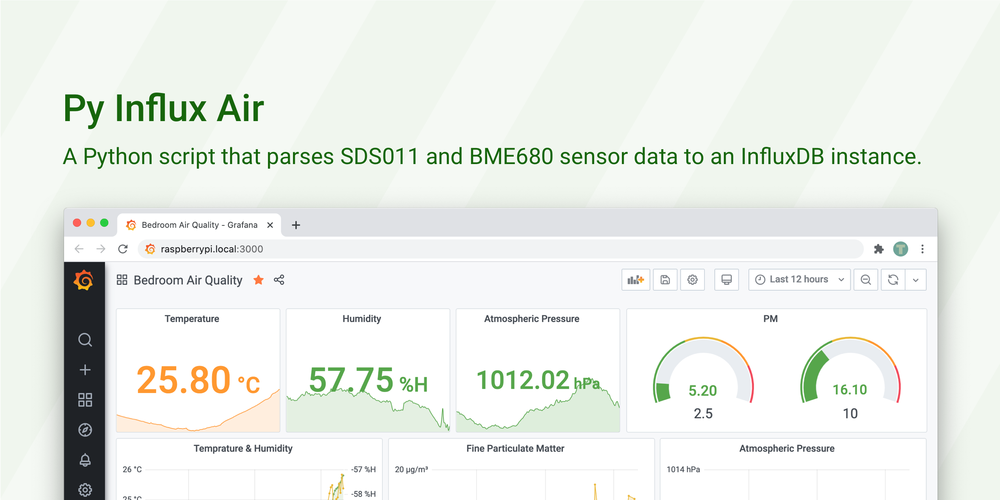
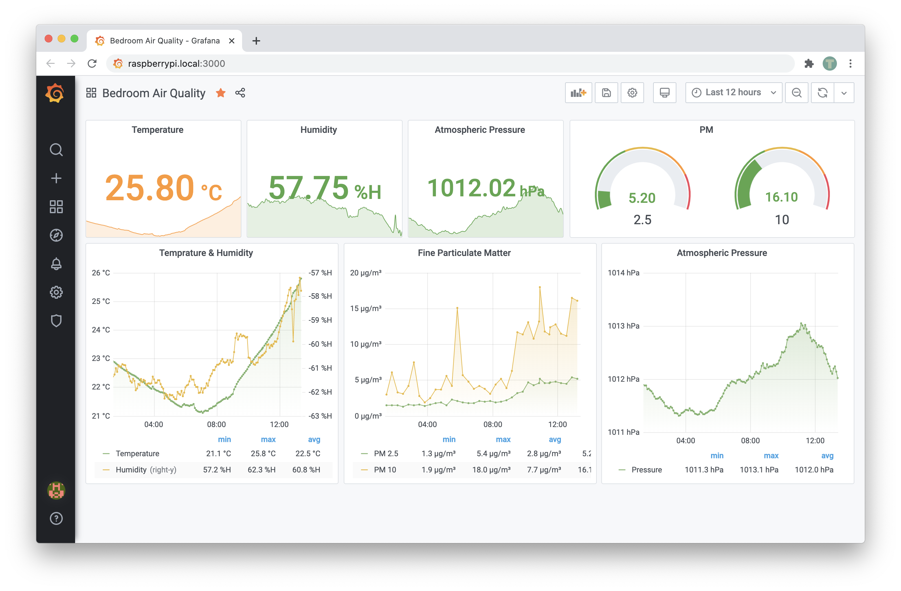

# py-influx-air



A Python script that parses [SDS011](http://www.inovafitness.com/en/a/chanpinzhongxin/95.html) and [BME680](https://shop.pimoroni.com/products/bme680-breakout) sensor data to an InfluxDB instance.

This project is forked from and inspired by:

- [jessedc/sds011-pm-sensor-python](https://github.com/jessedc/sds011-pm-sensor-python)
- [ikalchev/py-sds011](https://github.com/ikalchev/py-sds011)
- [pimoroni/bme680-python](https://github.com/pimoroni/bme680-python)

## Install

Step 1, create an environment file `.env.installed` from [`.env.example`](./.env.example).

```python
INFLUX_HOST=raspberrypi.local  # InfluxDB host, default is localhost
INFLUX_DB=airquality  # InfluxDB database
INFLUX_BME680_MEASUREMENT=weather  # InfluxDB mesurement of bme680 sensor
INFLUX_SDS011_MEASUREMENT=airquality  # InfluxDB mesurement of sds011 sensor
INFLUX_TAG_LOCATION=home  # InfluxDB location tag
INFLUX_TAG_GEOHASH=dqcjqcp1d  # InfluxDB geohash tag, lean more at https://www.movable-type.co.uk/scripts/geohash.html
SDS011_SENSOR_PORT=/dev/ttyAMA0  # SDS011 sensor port, default is /dev/ttyUSB0
```

Step 2, review [`py-influx-air.service#L9`](./py-influx-air.service#L9) and adjust the path of `WorkingDirectory` and `EnvironmentFile`.

Step 3, install the system service using:

```bash
bash ./install.sh
```

You may have to use `sudo` depending on your current user.

## Configure

The default warm-up period helps both sensors to stabilize readouts. You can change the settings in [`__main__.py#L49`](./air/__main__.py#L49).

The default configuration simulates a 20 minutes cycle with one SDS011 read and four BME680 reads. you can adjust the sensor intervals in [`__main__.py#L52`](./air/__main__.py#L52).

```python
# Designed to roughly model a 20 minutes cycle
warmup = 22 # 22 seconds to warm up for sds011 and bme680

# 5 min bme680 & 20 min sds011 cycle
interval = 300 # 300 sec/5 min - bme680 interval
cycle = 4 # 4:1 bme680-sds011 result ratio
```

## Data

The following data are collected from sensors and are written to the database.

SDS011:

- PM 2.5 (μg/m³)
- PM 10 (μg/m³)

BME680:

- Temperature (°C)
- Relative Humidity (%H)
- Atmospheric Pressure (hPa)

## Grafana Dashboard

[](https://snapshot.raintank.io/dashboard/snapshot/s7bKK9MwL0hu7r1cL0cZlt9kWuf9naii)
You can use Grafana to visualize these data, see a [Sample Grafana Dashboard](https://snapshot.raintank.io/dashboard/snapshot/s7bKK9MwL0hu7r1cL0cZlt9kWuf9naii).

## Homebridge

[](https://github.com/xtai/homebridge-influx-air)
You can use [homebridge-influx-air](https://github.com/xtai/homebridge-influx-air) to expose these measurements to the Apple Home App.
